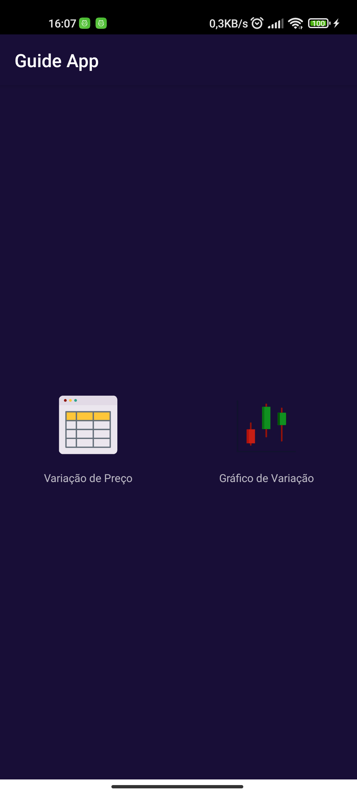
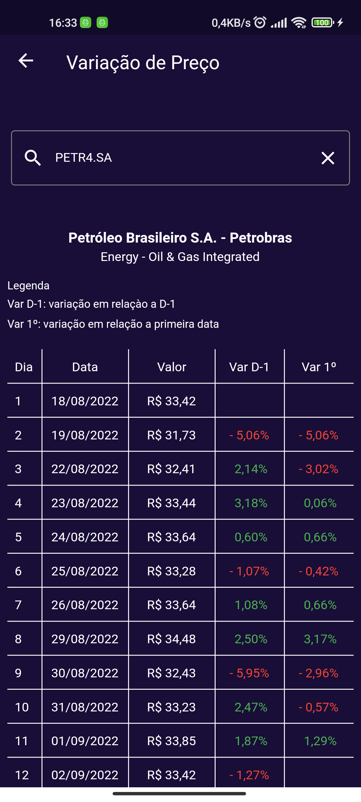
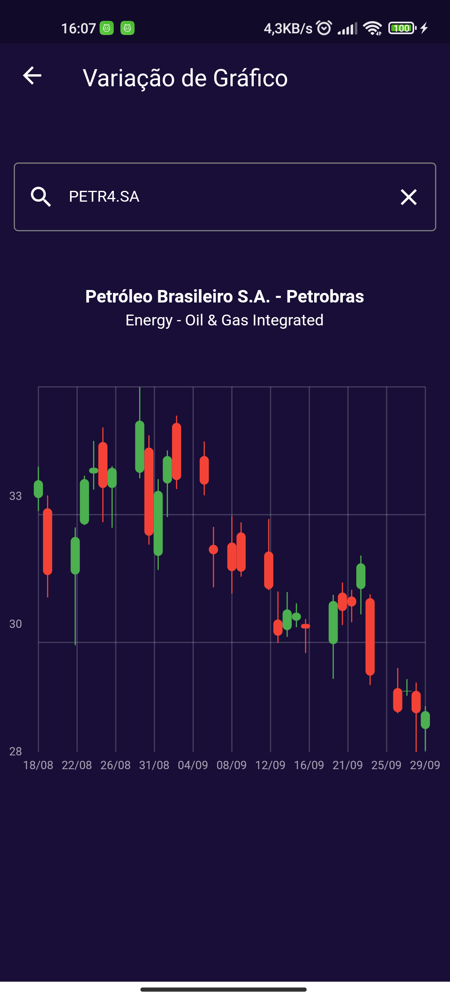

# Guide App

Teste prático para a Guide Investimentos

### ✔️ Projeto
- Projeto desenvolvido com Flutter versão 3.0.5
- Gestão de Estado - [GetX](https://pub.dev/packages/get)
- Client HTTP - [Dio](https://pub.dev/packages/dio)
- Charts - [MRX Charts](https://pub.dev/packages/mrx_charts)
- Auto Complete - [Flutter Typeahead](https://pub.dev/packages/flutter_typeahead)
---
 

### ✔️ Arquitetura
- Projeto Clean Code
- Projeto dividido em módulo (app, splash, price_variation e variation_graph)
- App com integração entre telas Android Java e telas Flutter
---
 

### 📡 API Yahoo Finance 
- API Rest utilizada para consultar ativos listados na bolsa e gráficos
- Base Url: https://query2.finance.yahoo.com
- Endpoint para busca de ativos: GET https://query2.finance.yahoo.com/v1/finance/search
- Endpoint para consultar dados de gráfico: GET https://query2.finance.yahoo.com/v8/finance/chart/PETR4.SA
---
 

### 🗺️ Telas do Aplicativo
A seguir algumas imagens do App

 
   
   
   

---
 

### 🔥 Configuracoes
- As variáveis de ambiente estão armazenadas no arquivo env.dart localizado na pasta lib/modules/app/domain/env.dart
- O tema do App pode ser personalizado acessando o arquivo light_theme.dart localizado na pasta lib/styles/themes/light_theme.dart
---
 

### 🔥 Executar Guide App
- O App pode ser executado rodando os comandos do Flutter
- flutter pub get
- flutter run
---
 

<footer>
  
 Copyright © Cássio Meira Silva 

